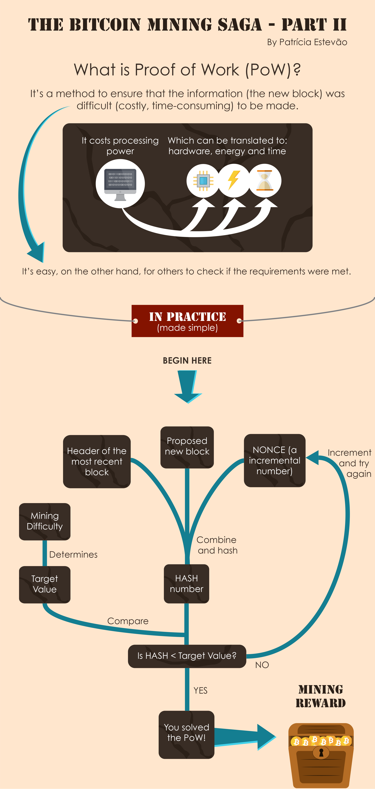

# Week 8: Algorithms

# Videos

## Bubble sort, mergesort, quicksort, selection sort and binary search
[Simple Algorithms](https://player.vimeo.com/video/207341712?api=false&autoplay=true&byline=false&color=%23444444&portrait=false&title=false)

## Polynomial vs Nondeterministic Polynomial Problems
[P vs. NP and the Computational Complexity Zoo](https://www.youtube.com/watch?v=YX40hbAHx3s)
  - Example Proof-of-work in blockchain mining
  - Producing a proof of work can be a random process with low probability but trivial to check whether data satisfies said requirements (NP problem)
  - 
